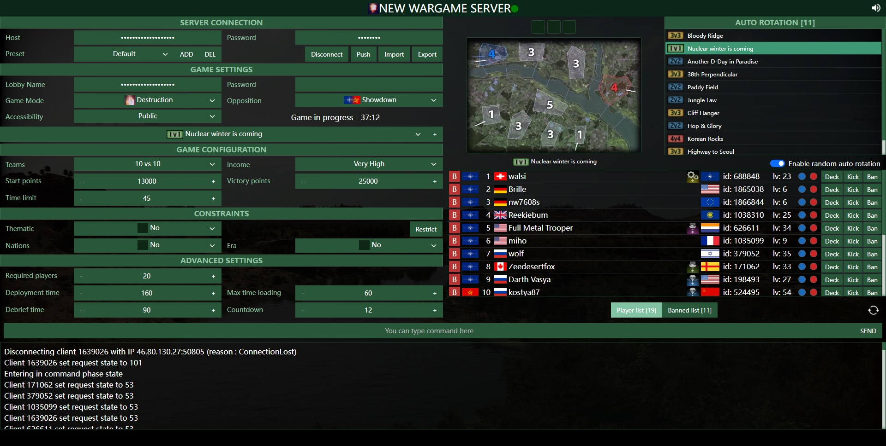

# Wargame RCON

Web-based wargame red dragon rcon tool

**this version will use kick to simulate ban command**

[Online Preview](http://wrd.endless.ws/)

#### Screenshot

<div align="center">
    
</div>

# Features

- Server variables settings

- Player management

- Level restrictions

- Deck restrictions (For example, ban support deck)

- Auto rotate map

- Game countdown

- Server broadcast message

- Sound when the game starts

- Automatically synchronize remote server variables to local

- Login information is saved locally

- Server logs and chat logs

# Install
if you need to use more features, please make sure that the RCON tool and the Wargame service are running on the same server and config.js is configured correctly.

<i>Port 8081 is used by default</i>

## Depends
- Debian or Ubuntu (need 32 bit support)
- Node.js

## Run
```bash
git clone https://github.com/RyderL/Wargame-RCON.git
cd Wargame-RCON
yarn
# if you need to use all features, please configure your config.js correctly
PORT=8081 && node main.js
```

## How to enable 32 bit support on 64 bit linux (debian, ubuntu)
```bash
sudo dpkg --add-architecture i386
sudo apt update
sudo apt install -y libc6:i386 libuuid1:i386 zlib1g:i386 libstdc++6:i386
```

## RCON Service unit file example
```bash
cat > /lib/systemd/system/wrd-rcon.service << EOF
[Unit]
Description=Wargame Red Dragon Rcon Service
After=network.target

[Service]
Type=simple
PermissionsStartOnly=true
WorkingDirectory=/data/rcon
ExecStart=/usr/local/node/bin/node /data/rcon/main.js
Restart=always
RestartSec=2s

[Install]
WantedBy=network.target
EOF

systemctl enable wrd-rcon
systemctl start wrd-rcon
```

## Wargame systemd unit file example
```bash
SRV_IP=$( curl ipinfo.io/ip )
SRV_PORT=10001
RCON_PORT=10101
RCON_PASSWD=123456
MMS_IP=178.32.126.73
MMS_PORT=10002

cat > /lib/systemd/system/wargame.service << EOF
[Unit]
Description=Wargame Red Dragon Service
After=network.target

[Service]
Type=simple
PermissionsStartOnly=true
WorkingDirectory=/data/wargame/
ExecStart=/data/wargame/wargame3-server +ip_mms $MMS_IP +port_mms $MMS_PORT +ip $SRV_IP +port $SRV_PORT +rcon_password $RCON_PASSWD +rcon_port $RCON_PORT +chat_log_file chat.log
Restart=always
RestartSec=2s

[Install]
WantedBy=network.target
EOF

systemctl enable wargame
systemctl start wargame
```